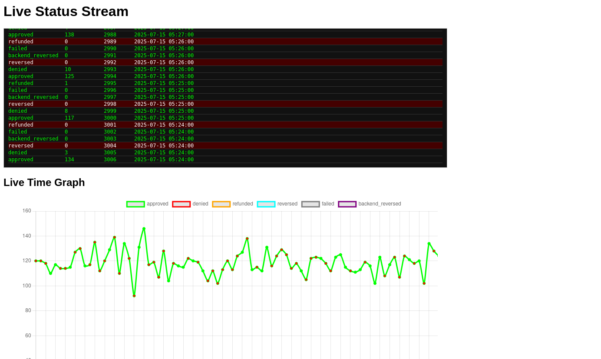

# CloudWalk interview challenge

As per requested during the interview, I hereby present my attempt at your challenge.

I will divide this on a per-task discussion.

## Task 1

On this challenge we are provided with two CSV files with limited data, checkout_1.csv
and checkout_2.csv. Each one consists of lines that include today's time, it's trans-
action rates per-hout, yesterday's transactions, last week's transactions, last week's
average and last month's transactions average.

To handle this I devised the following workflow:

Ingest the data into a SQLite database, as see in [import.py](./tasks/hands_dirty/import.py)
and then generate a graph trough a SQL query from it using matplotlib, seen in [test.svg](./tasks/hands_dirty/test.svg).
As to the direct questions:

### 1.Analyze the data provided and present your conclusions:
The data is very limited, but having the averages, yesterday's and today's values is somewhat
helpful. In a real-world scenario having a timeseries that is longer would be more useful.

### 2.In addition to the spreadsheet data, make a query in SQL and make a graphic of it and try to explain the anomaly behavior you found.
I assume that something might've gone wrong during the 15h-17h period. Either an infraestructure
outage or some other sort of incident. With the graphed data and what's available, assesing
more than this would be presumptious.

### 3.In this csv you have the number of sales of POS by hour comparing the same sales per hour from today, yesterday and the average of other days. So with this we can see the behavior from today and compare to other days.
This wasn't exactly a question, more of an affirmation as to what was already assesed.

## Task 2

Let's go over the requirements and what was done. I have implemented 1 endpoint with Python
and the FastAPI library that receives transaction data from 2 clients using Python's Requests
library, although they are somewhat fake as they just output the data we have on the CSVs.
The data is already organized both on the CSV's using GNU's `sort` and in the database during
ingestion. The model we applied to detect anomalies was done through averages of recent data,
and whatever falters too far from it gets us a warning in the front-end as well as the back-end.
This could've been improved by using a timeseries and a ml model, but, due to time constraints,
it was done like this. An example below of the image follows.


# Running this entire thing and testing it.
In order to run this code, the easiest way is using docker. So simply:
```
cd tasks/solve_problem
docker compose up
```
and then open `http://localhost:8000` on a browser.
